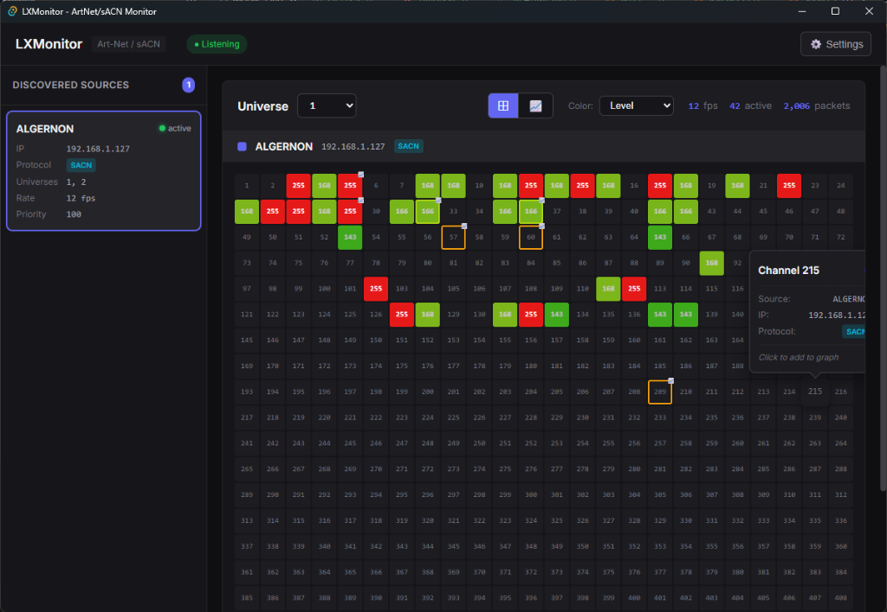

# LXMonitor

Universal Art-Net / sACN Network Monitor for Windows and macOS.



## Features

- **Source Discovery** — Automatically detects Art-Net and sACN sources on the network
- **Live DMX Viewing** — 512-channel grid with real-time value updates
- **Multiple Universes** — Switch between all detected universes
- **Channel Graphs** — Track channel values over time
- **4 Color Modes** — Level, Source, Last Used, Unused
- **11 Themes** — Dark, Light, Midnight, Forest, and more
- **Accessibility** — Dyslexic font, reduced motion, high contrast, large text

## Tech Stack

- **Frontend**: React + Vite
- **Backend**: Rust (Tauri)
- **Protocols**: Art-Net (UDP 6454), sACN/E1.31 (UDP 5568 multicast)

## Development

### Prerequisites

- [Node.js](https://nodejs.org/) (v18+)
- [Rust](https://rustup.rs/)
- [Tauri CLI](https://tauri.app/)

### Setup

```bash
# Install dependencies
npm install

# Run development server
npm run tauri dev
```

### Build

```bash
# Create production build
npm run tauri build
```

## Related Projects

- [LXLog](https://lxlog.netlify.app) — Lighting documentation and paperwork tool

## License

**Non-Commercial Use Only.**
Free for personal use. Redistribution for commercial purposes or sale is strictly prohibited.
See [LICENSE](LICENSE) for details.
