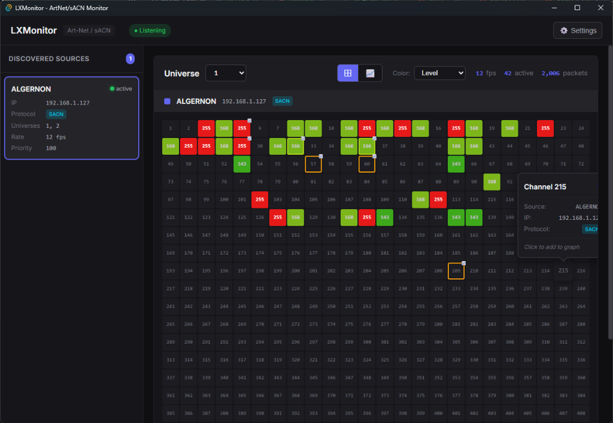

# LXMonitor

Universal Art-Net / sACN Network Monitor for Windows and macOS.



## Download

**[⬇️ Download Latest Release](https://github.com/kaelenfae/LXMonitor/releases/latest)**

| Platform | File |
|----------|------|
| macOS (Apple Silicon) | `LXMonitor_x.x.x_aarch64.dmg` |
| macOS (Intel) | `LXMonitor_x.x.x_x64.dmg` |
| Windows | `LXMonitor_x.x.x_x64-setup.exe` or `.msi` |

> **macOS users:** You may need to right-click → Open on first launch, as the app is not signed with an Apple Developer certificate.

## Features

- **Source Discovery** — Automatically detects Art-Net and sACN sources on the network
- **Live DMX Viewing** — 512-channel grid with real-time value updates
- **Multiple Universes** — Switch between all detected universes with a multi-universe dashboard
- **Channel Graphs** — Track channel values over time
- **Heatmap View** — Visualize channel activity as a heat map
- **4 Color Modes** — Level, Source, Last Used, Unused
- **Network Diagnostics** — FPS, jitter, packet loss, duplicate universe detection
- **11 Themes** — Dark, Light, Midnight, Forest, and more
- **Accessibility** — Dyslexic font, reduced motion, high contrast, large text
- **Data Export** — Export DMX snapshots and source lists as CSV

## Tech Stack

- **Frontend**: React + Vite
- **Backend**: Rust (Tauri)
- **Protocols**: Art-Net (UDP 6454), sACN/E1.31 (UDP 5568 multicast)

## Development

### Prerequisites

- [Node.js](https://nodejs.org/) (v18+)
- [Rust](https://rustup.rs/)
- [Tauri CLI](https://tauri.app/)

### Setup

```bash
# Install dependencies
npm install

# Run development server
npm run tauri dev
```

### Build

```bash
# Create production build
npm run tauri build
```

## Related Projects

- [LXLog](https://lxlog.netlify.app) — Lighting documentation and paperwork tool

## Support

If you find this tool useful, consider supporting the project:
[](https://ko-fi.com/lxlog)

## Credits

Created with the help of **Google Antigravity**.

## License

**Non-Commercial Use Only.**
Free for personal use. Redistribution for commercial purposes or sale is strictly prohibited.
See [LICENSE](LICENSE) for details.
